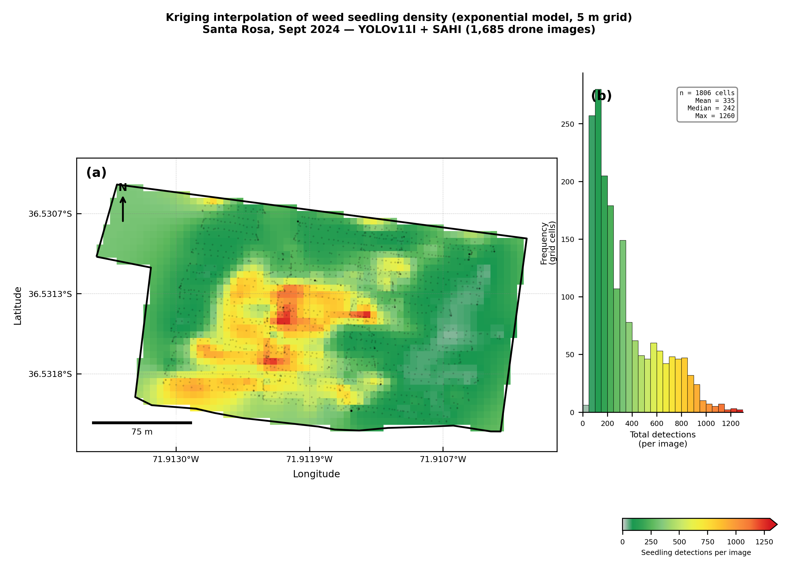
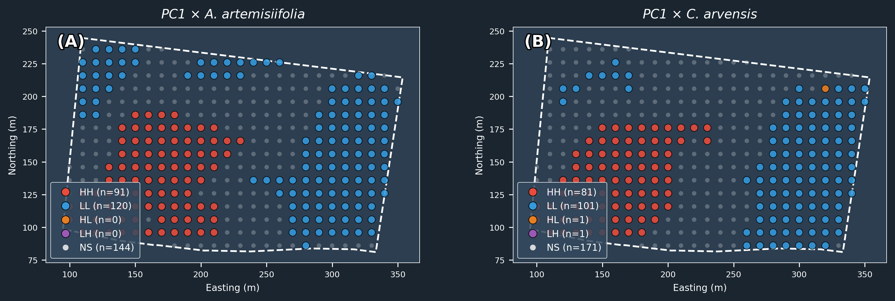
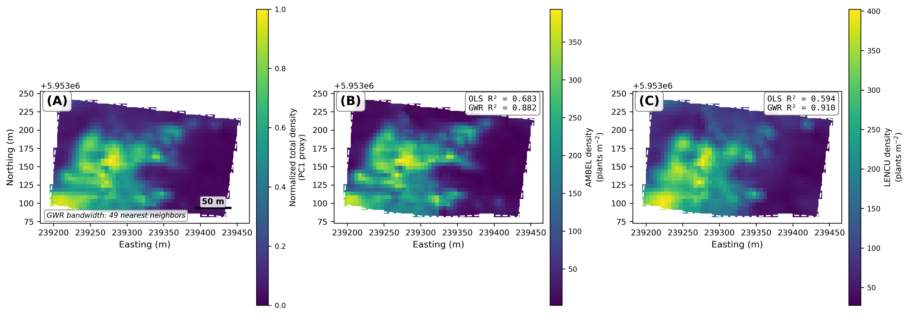
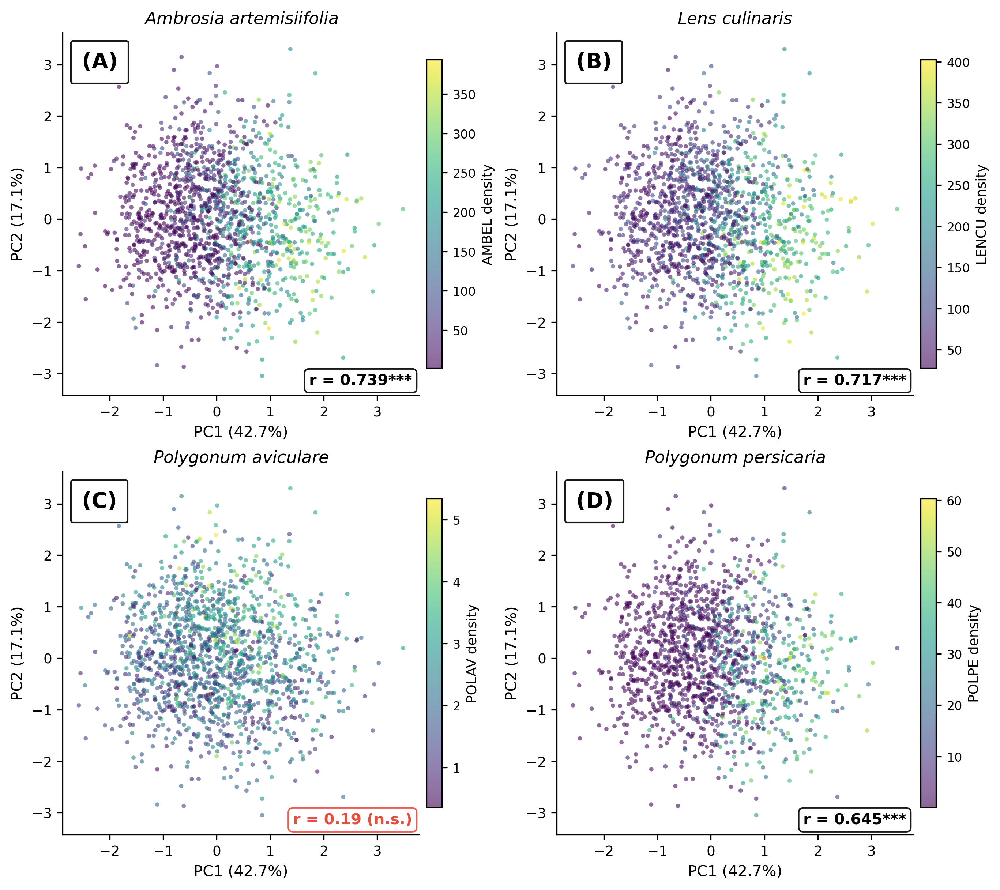
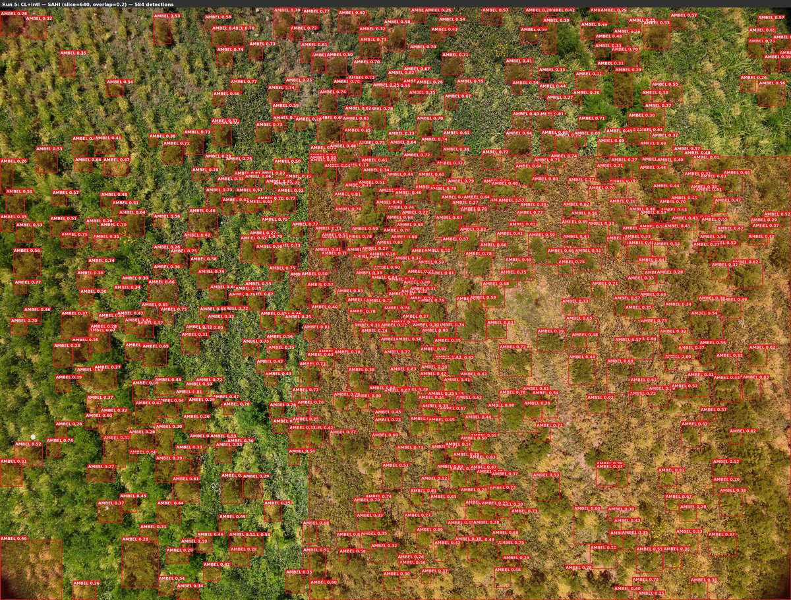
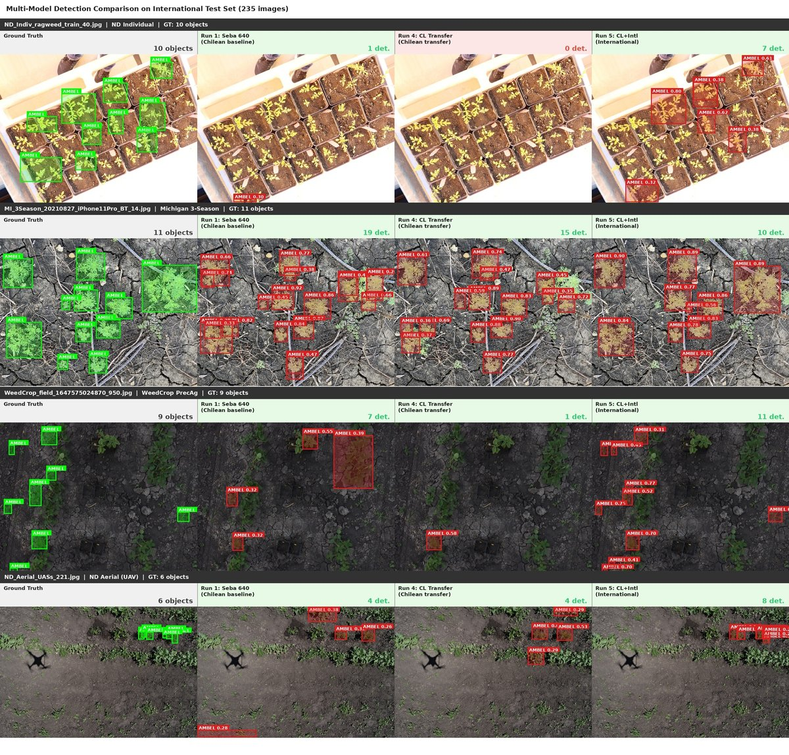
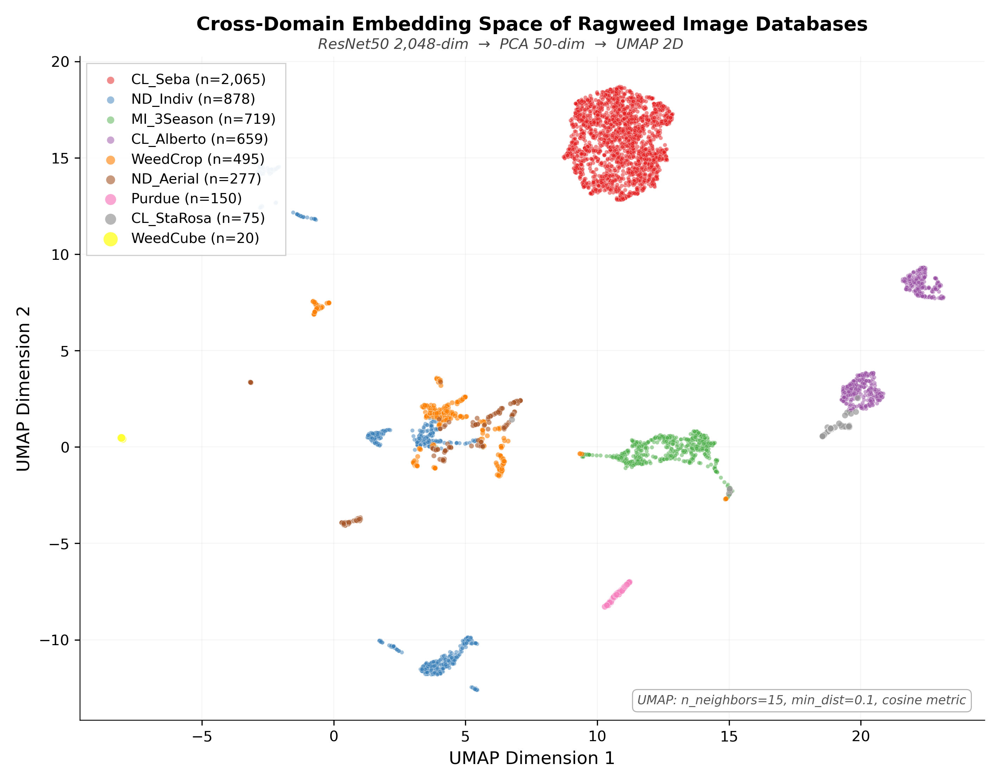
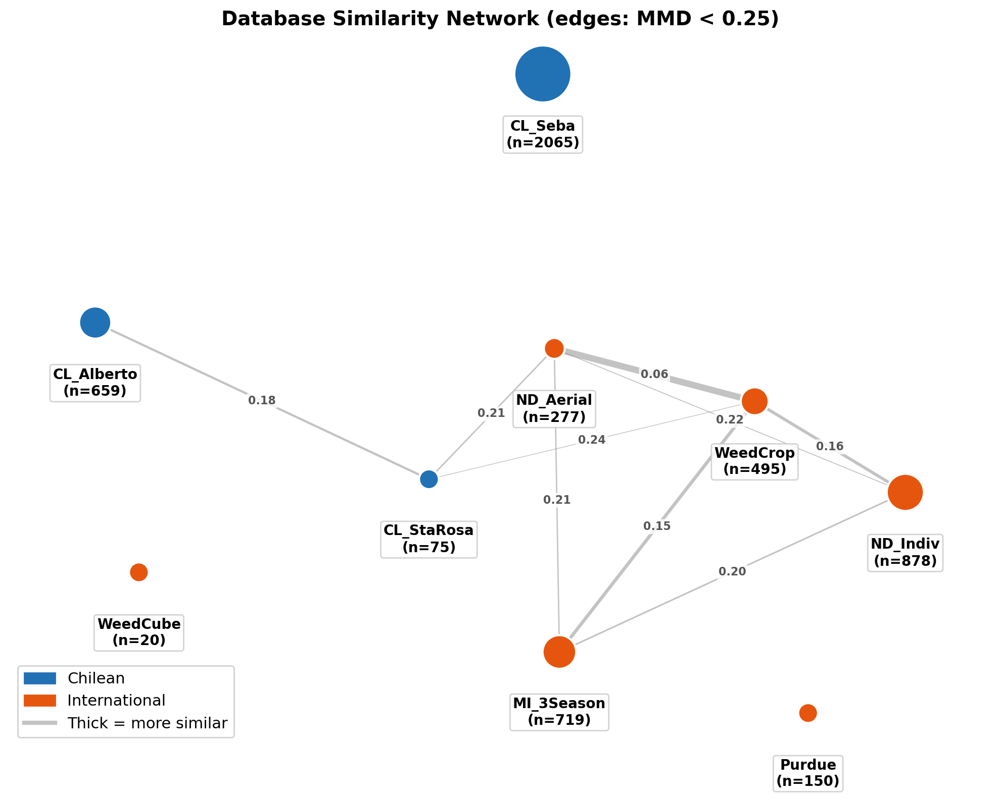
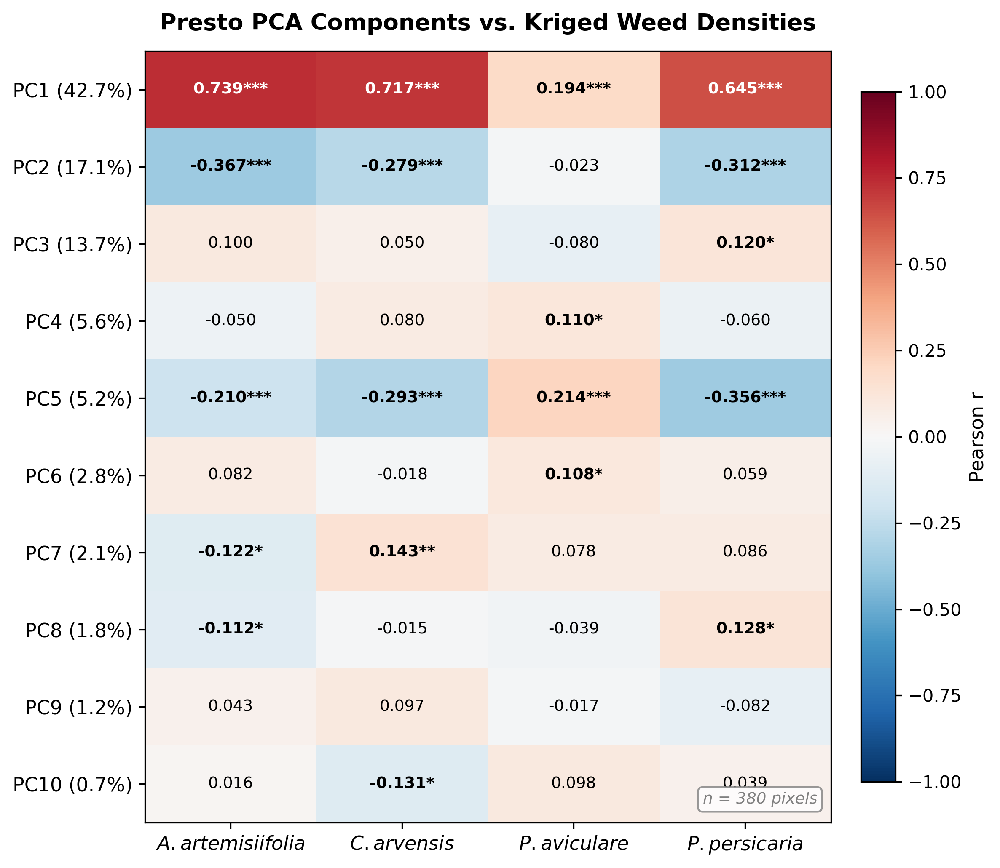
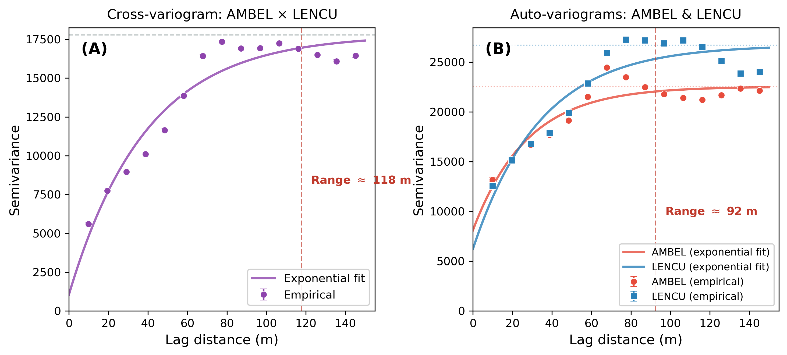

# Ragweed AI Toolkit

[](https://github.com/agroia-lab/ragweed-ai-toolkit/actions/workflows/test.yml)
[](https://github.com/agroia-lab/ragweed-ai-toolkit/actions/workflows/lint.yml)
[](https://agroia-lab.github.io/ragweed-ai-toolkit)
[](https://www.python.org/downloads/)
[](LICENSE)

**Multi-scale AI toolkit for weed detection, mapping, and spatial analysis.**

Companion software to the Springer Nature book chapter:

> **From Plant Detection to Satellite Mapping: A Multi-Scale AI Toolkit for Ragweed Surveillance under Climate Change**
>
> Lorenzo Leon et al.
>
> In: *Smart-Agriculture and Technology-Innovation: Facing the Dynamic of Climate Change*
> (Springer Nature, 2026)

---

## Visual Overview

### Spatial Maps

<table>
<tr>
<td width="50%">

**Kriging density map** -- Ordinary kriging interpolation (exponential model, 5 m grid) of weed seedling counts from 1,685 drone images. Hot spots (red) guide targeted herbicide application.

</td>
<td width="50%">

**LISA cluster analysis** -- Bivariate Local Moran's I (PC1 x weed density) identifies hot spots (HH, red), cold spots (LL, blue), and spatial outliers. 68% of pixels are significant at p < 0.05.

</td>
</tr>
<tr>
<td>



</td>
<td>



</td>
</tr>
<tr>
<td width="50%">

**GWR local R² maps** -- Geographically Weighted Regression captures spatially varying relationships. Panel (B): AMBEL R²=0.882; Panel (C): LENCU R²=0.910 with 49 nearest-neighbor bandwidth.

</td>
<td width="50%">

**PRESTO satellite correlations** -- Pearson correlations between PRESTO PCA components and kriged weed densities for four species (*A. artemisiifolia* r=0.739, *C. arvensis* r=0.717).

</td>
</tr>
<tr>
<td>



</td>
<td>



</td>
</tr>
</table>

### Field Detection

<table>
<tr>
<td width="50%">

**SAHI drone detection** -- YOLOv11 + SAHI sliced inference on a drone image of a lentil field (*Lens culinaris*). 584 adult *Ambrosia artemisiifolia* plants detected with bounding boxes and confidence scores.

</td>
<td width="50%">

**Cross-domain model comparison** -- Same images evaluated by three models: Chilean baseline (Run 1), Chilean transfer (Run 4), and international multi-domain (Run 5). Domain shift causes catastrophic failure; multi-source training recovers performance.

</td>
</tr>
<tr>
<td>



</td>
<td>



</td>
</tr>
</table>

### Embedding Analysis

<table>
<tr>
<td width="50%">

**Cross-domain embedding space** -- ResNet-50 features from 9 international ragweed databases projected to 2D with UMAP. Each color is a different image source (5,338 images total).

</td>
<td width="50%">

**MMD similarity network** -- Maximum Mean Discrepancy between database pairs. Edge thickness indicates domain similarity; Chilean (blue) and international (orange) sources form distinct clusters.

</td>
</tr>
<tr>
<td>



</td>
<td>



</td>
</tr>
</table>

### Geostatistics

<table>
<tr>
<td width="50%">

**Spectral indices heatmap** -- Pearson correlations between 10 PRESTO PCA components and kriged densities of four weed species. PC1 (42.7% variance) is the strongest predictor.

</td>
<td width="50%">

**Variogram analysis** -- Experimental and fitted exponential variograms for cross- and auto-correlation. Spatial dependence range: 92--118 m, informing kriging interpolation parameters.

</td>
</tr>
<tr>
<td>



</td>
<td>



</td>
</tr>
</table>

---

## What This Toolkit Does

Three complementary scales of analysis for precision weed management:

```
FIELD (cm)              CROSS-DOMAIN            SATELLITE (10 m)
YOLOv11 + SAHI    -->   ResNet-50 + MMD    -->   PRESTO + GWR
detect plants           assess deployment        map risk zones
                        readiness
         |                     |                       |
         v                     v                       v
    Kriging maps          Deployment gates         LISA clusters
    (5 m density)         (green/yellow/           (hot spots /
                           orange/red)              cold spots)
```

| Scale | Module | What it does |
|-------|--------|-------------|
| Field | `detection` | YOLOv11 training + SAHI sliced inference + GPS extraction |
| Field | `geostatistics` | Ordinary kriging density surfaces from point detections |
| Field | `orthomosaic` | Drone mosaic tiling, georeferenced export, active learning |
| Cross-domain | `embeddings` | ResNet-50 features, MMD distance, UMAP/t-SNE |
| Cross-domain | `crossdomain` | Multi-source dataset building, transfer evaluation |
| Satellite | `satellite` | PRESTO embeddings, Sentinel-2 composites, spectral indices |
| Satellite | `spatial` | Bivariate Moran's I, LISA clusters, GWR |
| All | `viz` | Publication-quality figures at 300 DPI |

## Installation

```bash
# Clone
git clone https://github.com/agroia-lab/ragweed-ai-toolkit.git
cd ragweed-ai-toolkit

# Install core (numpy, pandas, geopandas, matplotlib, scipy)
pip install -e .

# Install with specific modules
pip install -e ".[detection]"      # + ultralytics, sahi, opencv
pip install -e ".[embeddings]"     # + torch, torchvision, umap-learn
pip install -e ".[spatial]"        # + pygeoda, esda, libpysal, mgwr
pip install -e ".[satellite]"      # + earthengine-api, rasterio

# Install everything
pip install -e ".[all]"

# Development (adds pytest, ruff, pre-commit)
pip install -e ".[all,dev]"
```

## Quick Start

### 1. Train a YOLOv11 detector

```python
from ragweed_toolkit.detection import TrainingConfig, train

config = TrainingConfig(
    model="yolo11l.pt",
    data="path/to/data.yaml",
    epochs=50,
    imgsz=640,
    batch=64,
    device="0,1",  # dual GPU
)
result = train(config)
print(f"Best mAP50: {result['metrics']['mAP50']:.3f}")
print(f"Weights: {result['best_weights']}")
```

### 2. Run SAHI sliced inference

```python
from ragweed_toolkit.detection import SahiConfig, run_sahi_batch

config = SahiConfig(slice_size=640, overlap=0.2, conf_threshold=0.25)
results = run_sahi_batch("path/to/best.pt", image_paths, config)
# Each result: {class_id, class_name, bbox, confidence}
```

### 3. Extract GPS and export to shapefile

```python
from ragweed_toolkit.detection import extract_gps_geodataframe

gdf = extract_gps_geodataframe(image_paths)
gdf.to_file("detections.gpkg", driver="GPKG")
```

### 4. Compute embeddings + MMD deployment gate

```python
from ragweed_toolkit.embeddings import (
    FeatureExtractor, extract_embeddings,
    compute_mmd, deployment_gate
)

# Extract 2048-D ResNet-50 features
extractor = FeatureExtractor()
embeddings_source = extract_embeddings(extractor, source_images)
embeddings_target = extract_embeddings(extractor, target_images)

# Check domain shift
mmd_value = compute_mmd(embeddings_source, embeddings_target)
result = deployment_gate(mmd_value)
print(f"MMD = {mmd_value:.3f} -> {result.tier} tier: {result.recommendation}")
# MMD = 0.32 -> orange tier: Active learning before deployment
```

### 5. Dimensionality reduction + visualization

```python
from ragweed_toolkit.embeddings import reduce_embeddings, umap_scatter

df = reduce_embeddings(embeddings, method="umap", metadata={"database": labels})
fig = umap_scatter(df, color_col="database", title="Cross-domain embedding space")
fig.write_html("umap.html")
```

### 6. Ordinary kriging density map

```python
from ragweed_toolkit.geostatistics import (
    compute_experimental_variogram,
    fit_exponential_model,
    ordinary_kriging,
)

bins, semivariance = compute_experimental_variogram(gdf, value_col="count")
model = fit_exponential_model(bins, semivariance)
grid = ordinary_kriging(gdf, value_col="count", boundary=polygon, resolution=5.0,
                        variogram_model=model)
```

### 7. LISA cluster analysis

```python
from ragweed_toolkit.spatial import compute_bivariate_lisa, lisa_summary

gdf_lisa = compute_bivariate_lisa(gdf, var_x="PC1", var_y="weed_density",
                                  threshold=15.0, permutations=999)
print(lisa_summary(gdf_lisa))
# HH (Hot Spot):  109 (28.7%) -> Priority treatment
# LL (Cold Spot): 126 (33.2%) -> Monitoring only
# HL (Outlier):    22 (5.8%)  -> Spectral outlier
# LH (Outlier):     1 (0.3%)  -> Missed infestation
```

### 8. Geographically Weighted Regression

```python
from ragweed_toolkit.spatial import compare_ols_gwr

comparison = compare_ols_gwr(gdf, y_col="AMBEL_density",
                              x_cols=["PC1", "PC2", "PC3"])
print(f"OLS R²: {comparison.ols.r_squared:.3f}")
print(f"GWR R²: {comparison.gwr.r_squared:.3f} (bandwidth={comparison.gwr.bandwidth})")
# OLS R²: 0.683
# GWR R²: 0.882 (bandwidth=49)
```

### 9. Sentinel-2 spectral indices

```python
from ragweed_toolkit.satellite import compute_spectral_indices

# From a 10-band Sentinel-2 array
indices = compute_spectral_indices(band_array)
# Returns dict: {NDVI, EVI, GNDVI, SWIRd, NBR2, SAVI, NDMI, BSI, NDWI}
```

## Architecture

```
ragweed-ai-toolkit/
├── src/ragweed_toolkit/       # Installable Python package
│   ├── detection/             #   YOLOv11 + SAHI + GPS + metrics
│   ├── embeddings/            #   ResNet-50 + MMD + UMAP/t-SNE
│   ├── crossdomain/           #   Multi-source datasets + transfer eval
│   ├── orthomosaic/           #   Drone mosaic tiling + georeferencing
│   ├── geostatistics/         #   Kriging + semivariograms
│   ├── spatial/               #   Moran's I + LISA + GWR + variograms
│   ├── satellite/             #   PRESTO + Sentinel-2 + spectral indices
│   └── viz/                   #   Publication figures (300 DPI)
├── tools/                     # CLI scripts (import from package)
│   ├── 01_detection/
│   ├── 02_embedding/
│   ├── 03_crossdomain/
│   ├── 04_orthomosaic/
│   ├── 05_geostatistics/
│   └── 06_satellite/
├── chapter/                   # Springer chapter figures + tables
├── evidence/                  # Per-exercise evidence documentation
├── configs/                   # Dataset YAML configurations
├── docs/                      # Extended documentation
├── tests/                     # Unit tests
├── examples/                  # Example scripts
├── pyproject.toml
├── LICENSE (MIT)
└── README.md
```

## Key Results from the Chapter

| Metric | Value |
|--------|-------|
| Best field detection (mAP50) | 0.886 |
| Cross-domain collapse (CL -> Int'l) | 0.886 -> 0.108 |
| Multi-domain recovery | 0.874 |
| PRESTO PC1 x AMBEL correlation | r = 0.739 |
| GWR R² (AMBEL, 3 PCs) | 0.882 |
| GWR R² (LENCU, 3 PCs) | 0.910 |
| LISA significant pixels | 68% |

## Citation

If you use this toolkit in your research, please cite:

```bibtex
@incollection{leon2026ragweed,
  title     = {AI-Driven Spatial Decision-Support for Sustainable Weed
               Management under Climate Variability},
  author    = {Le{\'o}n, Lorenzo},
  booktitle = {Smart-Agriculture and Technology-Innovation: Facing the
               Dynamic of Climate Change},
  publisher = {Springer Nature},
  year      = {2026},
}
```

## License

MIT License. See [LICENSE](LICENSE) for details.

## Contributing

Contributions welcome. Please open an issue first to discuss changes.

```bash
# Development setup
pip install -e ".[all,dev]"
pytest
ruff check src/
```
